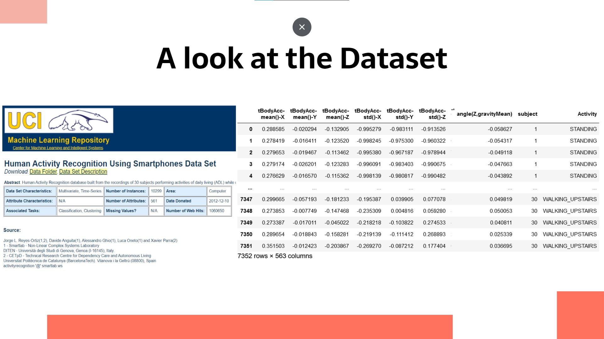
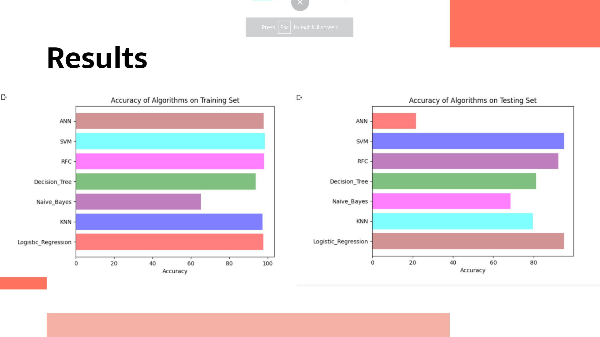
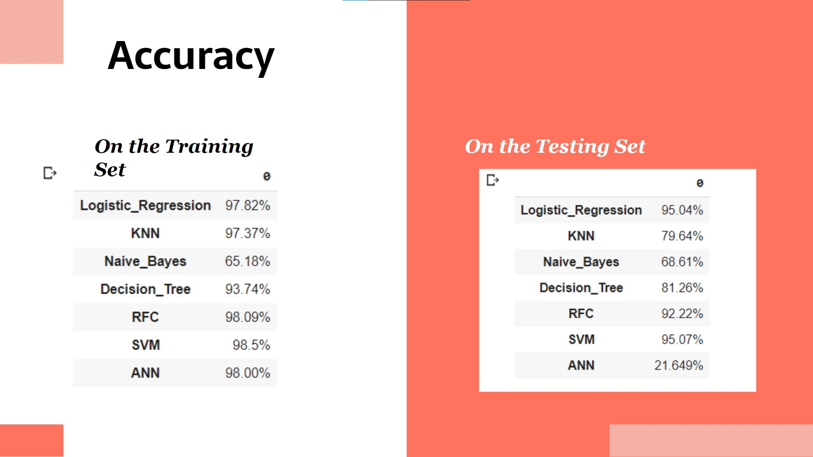

# Human-Activity-Recognition-ML
<h1> Abstract </h1>
<ul>
<li>The goal of this project was to use various machine learning techniques and algorithms in order to detect human activity from the data gathered by accelerometer and gyroscope of smartphones. </li>
<li>For this project I have used the UCI Human Activity Dataset that’s available in the UCI ML repo and also on kaggle.com. </li>
<li>This dataset was created by running experiments on 30 volunteers of age 19-48, performing six different activities (walking, walking upstairs, walking downstairs, sitting, standing, laying) whilst wearing a Samsung Galaxy S2 on their waist. </li>
<li>The 562 features of this dataset include the tri-axial linear acceleration and Tri-axial angular velocity was captured at a constant rate of 50Hz. </li>
</ul>

<h1> The Algorithms Used In This Project </h1>

Since it’s a classification problem, the following algorithms were used in order to predict the type of activity that was performed by the test subject:

  <ol>
        <li>Logistic Regression </li>
    <li>K-Nearest Neighbor (KNN) </li>
    <li> Naive Bayes</li>
    <li> Decision Tree</li>
    <li>Support Vector Machine(SVM) </li>
    <li> Random Forest Classifier </li>
    <li> Artificial Neural Network (ANN) </li>
  </ol>

<h1> Accuracy </h1>

<h1> Analysis </h1>
<ul>
<li>As we can see from the results, logistic regression(95.04%) , RFC(92.22) and SVM(95.07%) generalized remarkably well on the testing dataset. </li>
<li>The models that used KNN and decision tree, also showed acceptable results on the testing set. </li>
  <li>However, the Naive Bayes classifier had overall worse performance. </li>
<li>And the model that used Artificial Neural Network did not generalized well, at all and it performed poorly on the testing set. This is due to overfitting on the training set. </li>
</ul>
